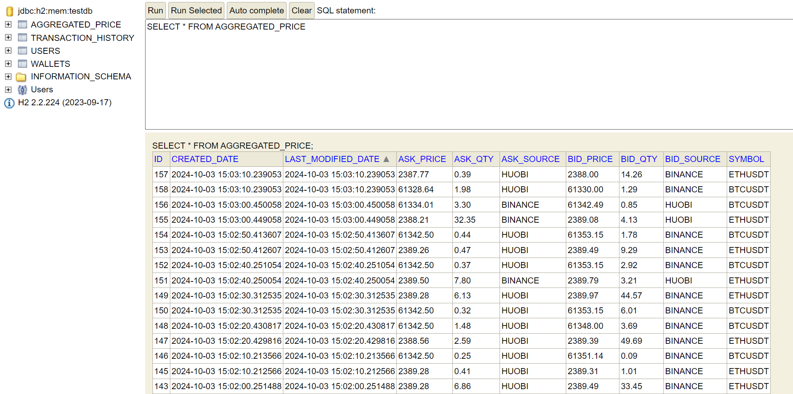
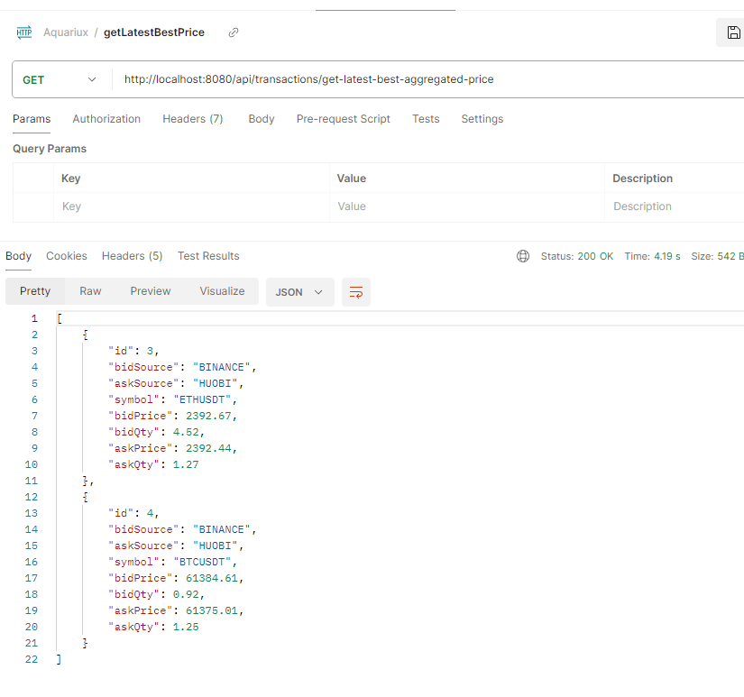
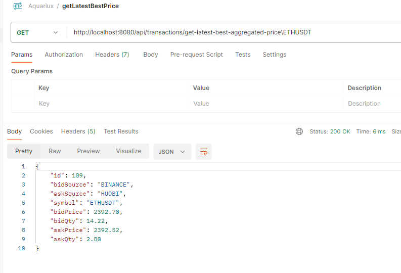
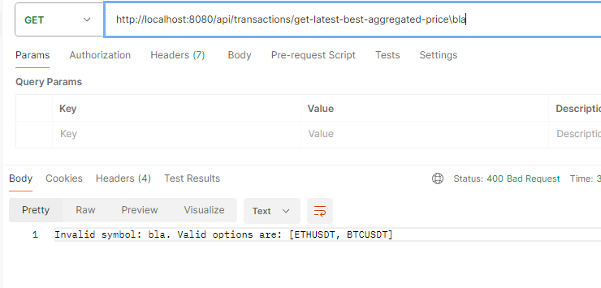
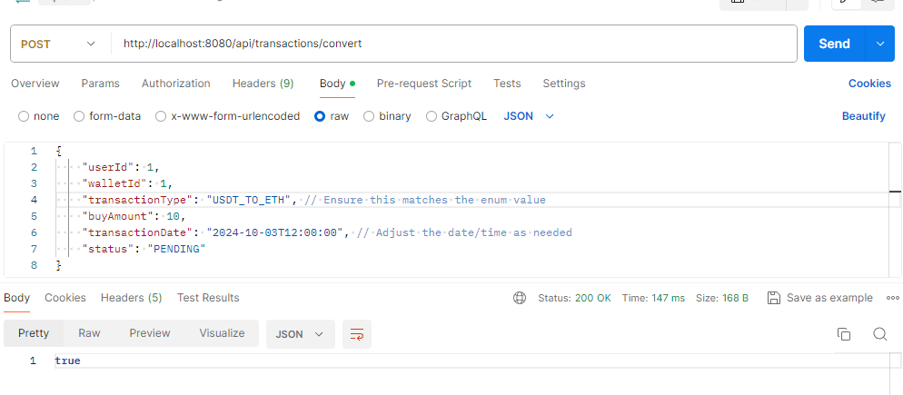
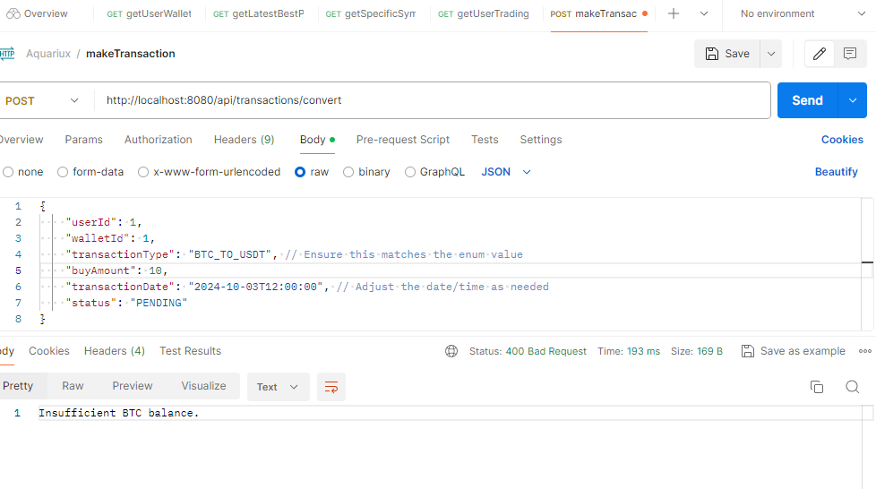
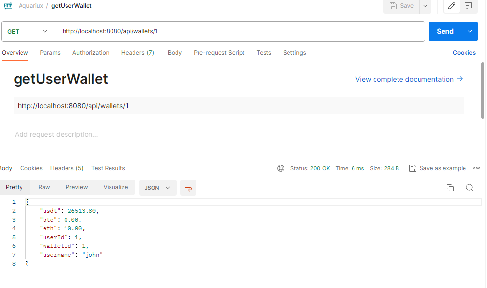
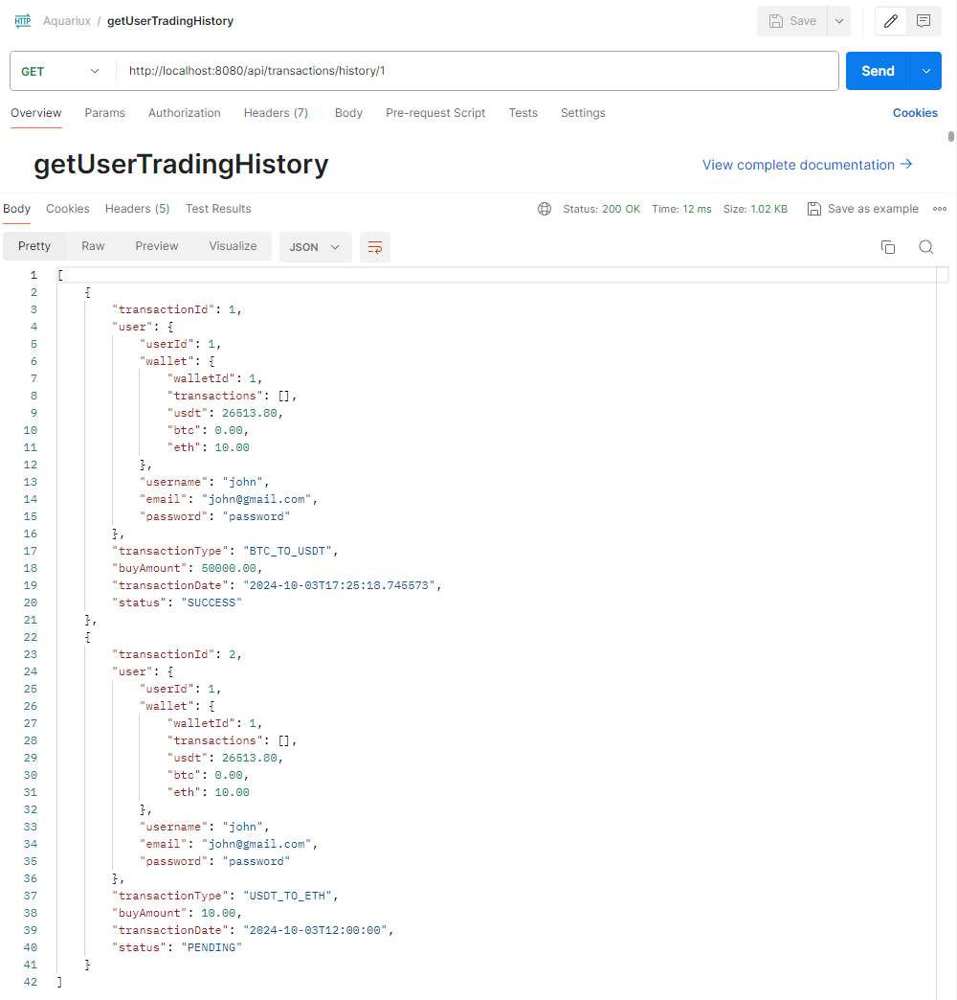

## Screenshot (Task)
API link via postman: https://www.postman.com/avionics-astronomer-21090150/aquariux/collection/waj0fdb/aquariux

1. scheduler + best pricing

2. retrieve the latest best aggregated price

- get the latest best pricing for all symbol

- get the latest best pricing for specific symbol

- error mssg when the symbol is not available 

3. trade based on the latest best aggregated price

- insufficient balance

4. retrieve the user’s cryptocurrencies wallet balance

5. retrieve the user trading history

